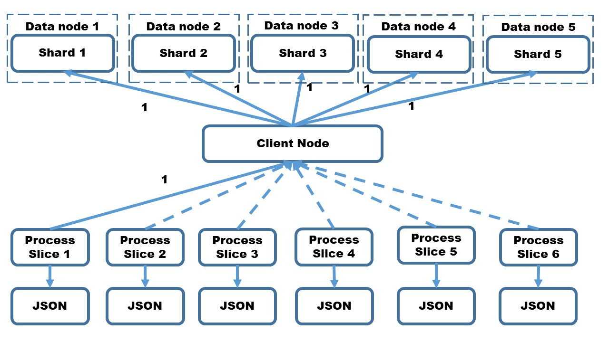

# ES_Sliced_Scroll

Elasticsearch provides scrollAPI for retrieving large numbers of results (or even all results) from a single search request, in much the same way as you would use a cursor on a traditional database. Unfortunately, in sequential manner, single scroll API invocation takes more than 24 hours to retrieve huge data data ranging from millions to billions.

Figure 4 depicts multiplexed scroll API of Elasticsearch. Key technology here is sliced scroll which is introduced in Elasticserch 5.0.0. Usually scroll queries return a lot of documents.Byusingslicedscroll,itispossibletosplitthescrollin multiple slices which can be consumed independently In our system, as shown in Figure 4, each process 1-6 is reponsible forslices1-6.Cocerningprocess1(slice1),itissuesthequery for five shards. In total, 6(slices)∗5(shards) = 30(threads) are launched.
