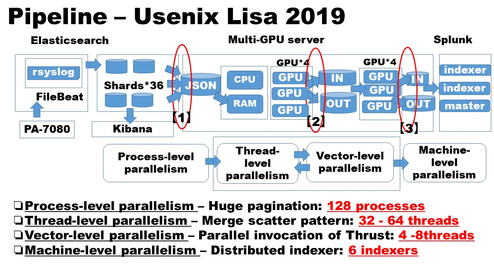

# Usenix LISA 2019
Multi-GPU Accelerated Processing of Time-Series Data of Huge Academic Backbone Network in ELK Stack

# [0] Source tree

<pre>
.
|-- clustering
|   `-- gpu
|-- direction_discrimination
|   |-- cpu
|   `-- gpu
|-- generator
|-- misc
|-- parallel_exporter
|   `-- Output_SessionData
|-- plot
|-- putSession
|   |-- conf
|   |-- ElasticBulk_Data
|   `-- Output_SessionData
`-- histogramming_by_reduction
    |-- cpu
    |-- gpu
    `-- stl
</pre>

[0] clustering: under testing

[1] direction_discrimination: bitmasking and matching with CUDA Thrust (you will need your own IP address list to match)
<pre>
X.X.X.X/24
Y.Y.Y.Y/28
</pre>

[2] generator: random session data generator.

[3] misc: merge scatter and pairwise reduction

[4] paralel_exporter: parallel scroll API invocation

[5] plot: matplotlib

[6] putSession: parallel bulk inserter

[7] histogramming_by_reduction: histogramming with CUDA Thrust and Intel TBB

# [1] Parallel bulk inserter

<pre>
#cd ./putSession
</pre>

1.1: Modify USR and ADDRESS:
<pre>
# head -n 4 putSessionDataElastic.sh
1: DIR=$(cd $(dirname $0);pwd)/
2: 
3: USR=user_name
4: ADDRESS=X.X.X.X:9200
</pre>

1.2: Set password of Elasticsearch:
<pre>
# cd conf/
# head -n 1 putSessionDataElastic.conf
server_password
</pre>

1.3: Delete index (to make sure):
<pre>
curl -XDELETE username:password@192.168.64.195:9200/import_sessionlog_20190702
</pre>

1.4: Build the binary:
<pre>
# ./build.sh rand_gen
</pre>

1.5: Generate random data:
<pre>
# time ./rand_gen 100000

real    0m3.122s
user    0m2.985s
sys     0m0.136s
</pre>

1.6: Move generated data to ./Output_SessionData
<pre>
# rm -rf Output_SessionData/random_data.txt
# mv random_data.txt ./Output_SessionData/
</pre>

1.7: Execute
<pre>
time ./putSessionDataElastic.sh 20190702                                                                            
--------------------------------------------
-- putSessionDataElastic.sh (start) [2019/10/25 17:36:41]
--------------------------------------------
--------------------------------------------
-- getSessionDataCSv.sh: checking process [2019/10/25 17:36:41]
--------------------------------------------
--------------------------------------------
-- splitSessionData.py(start) [2019/10/25 17:36:41]
--------------------------------------------
/mnt/data/ES_Sliced_Scroll/putSession//Output_SessionData/random_data.txt Split Start. (2019-10-25 17:36:41) (PID = 152900)
/mnt/data/ES_Sliced_Scroll/putSession//Output_SessionData/random_data.txt Split End. (2019-10-25 17:36:41) (PID = 152900)
elapsed_time:0.1305809021[sec]
--------------------------------------------
-- splitSessionData.py: finished [2019/10/25 17:36:42]
--------------------------------------------
--------------------------------------------
-- putSessionDataElasticBulk.py (start) [2019/10/25 17:36:42]
--------------------------------------------
/mnt/data/ES_Sliced_Scroll/putSession//ElasticBulk_Data/INPUT_152900_20191025173641_982501 Bulk Start. (2019-10-25 17:36:42) (PID = 153070)
/mnt/data/ES_Sliced_Scroll/putSession//ElasticBulk_Data/INPUT_152900_20191025173641_982501 Bulk End. (2019-10-25 17:36:43) (PID = 153070)
elapsed_time:1.28126597404[sec]
--------------------------------------------
-- putSessionDataElasticBulk.py finished [2019/10/25 17:36:43]
--------------------------------------------
{"error":{"root_cause":[{"type":"security_exception","reason":"failed to authenticate user [elastic]","header":{"WWW-Authenticate":"Basic realm=\"security\" charset=\"UTF-8\""}}],"type":"security_exception","reason":"failed to authenticate user [elastic]","header":{"WWW-Authenticate":"Basic realm=\"security\" charset=\"UTF-8\""}},"status":401}
--------------------------------------------
-- putSessionDataElastic.sh (finished) [2019/10/25 17:36:43]
--------------------------------------------

real    0m1.953s
user    0m1.333s
sys     0m1.614s
</pre>

You see the error message above. But it might be OK.

# [2] Parallel exporter

2.1: Modify USR, PASSWD and ADDRESS.

<pre>
# head -n 30 ./getSessionDataCSv.sh

 18# Level of multiplex
 19MULTIPLE=32
 20
 21# Elasticsearch connection parameters
 22# Please change these four itmes in your environment
 23USR=user_name
 24PASSWD=password
 25ADDRESS=Y.Y.Y.Y:9200
 26INDEXNAME=session_info
</pre>

2.2 Execute (after 1.1-1.7 done)
<pre>
# ./getSessionDataCSv.sh "2019/07/02 00:00" "2019/07/02 23:59"

/mnt/data/ES_Sliced_Scroll/parallel_exporter
== Starting data retrieval: 2019/10/25 17:50:02 ==
--------------------------------------------
-- Level of multiplex: 32
--------------------------------------------
-- The total number of data to be retrieved: 10000
--------------------------------------------
-- Log file: info_getSessionDataCSv.log
--------------------------------------------
-- Output CSV: /mnt/data/ES_Sliced_Scroll/parallel_exporter/Output_SessionData/OUTPUT_20190702_0000-20190702_2359_32.csv
--------------------------------------------
-- Retrieving data... PROGRESS: 288 / [*********+*********+*********+*********+*********+*********+*********+*********+*********+*********+*********+*********+*********+*********+*********+*********+*********+*********+*********+*********+*********+*********+*********+*********+*********+*********+*********+*********+********]
--------------------------------------------
== Data output is finished: 2019/10/25 17:54:58 ==
</pre>

# [3] Histogramming with CUDA Thrust

<pre>
# cd histogramming_by_reduction/gpu/                   
</pre>

THREAD=4, GPU=1

grep THREAD_NUM multi12.cpp
<pre>
#define WORKER_THREAD_NUM 5                                    
</pre>

grep GPU_number kernel.cu -rin
<pre>
37:    // int GPU_number = thread_id % 4;
38:    int GPU_number = 0;
76:    int GPU_number = 0;
</pre>

<pre>
# ./build.sh rand_gen
# time ./rand_gen 10000
# split -l 1000 random_data.txt 
# mv x* ./data/
#  ./build-traverse.sh multi12
#  time ./multi12 data/
</pre>

When you are to change # of GPU to more than one, change GPU_number (kernel.cu).

# [4] Direction discrimination of session data with CUDA Thrust

You need a list of IP address range such as:

<pre>
Z.Z.Z.Z/24
W.W.W.W/27
</pre>

For example, this could be informative:
<pre>
https://docs.aws.amazon.com/general/latest/gr/aws-ip-ranges.html
</pre>

<pre>
THREAD=32: GPU
ThreadID26:[125]155(156):X.X.X.X/27 @ 1001//xdw
time of travdirtime:22944.036000[msec]
[128]1000000,1000000@ 1001//xdw
[insertion]          0.478790063 sec
[tranfering]          0.034528034 sec
[transform1]          0.000054723 sec
[transform2]          0.000032898 sec
[transfer2]          0.207891347 sec
discern 1 (srcIP)         0.724947175 sec
[insertion]          0.431377968 sec
[tranfering]          0.034297542 sec
[transform1]          0.000039529 sec
[transform2]          0.000014678 sec
[transfer2]          0.207339581 sec
discern 2 (destIP)          0.676383075 sec
ThreadID19:[128]155(156):Y.Y.Y.Y/24 @ 1001//xbx
time of travdirtime:22508.867000[msec]
[129]1000000, 1000000@ 1001//xbx
total# of files :0

real    297m7.229s
user    8630m24.783s
sys     317m1.345s

THREAD=32: CPU
ThreadID:20[125]155(156):Z.Z.Z.Z/27 155 - 29.708084771 sec @ 1009//xcm
INGRESS:10000000,EGRESS:10000000, ALL:20000000 @ [126]1009//xcm
total# of files :0

real    430m51.944s
user    12655m0.012s
sys     382m13.561s
</pre>

