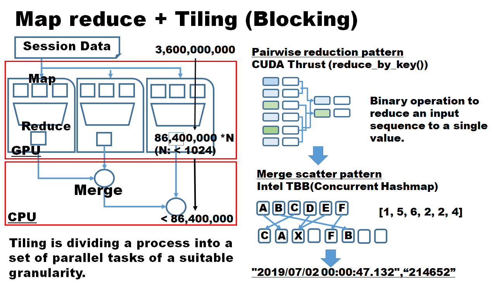

# Reduction with CUDA Thrust

THREAD=2, GPU=0

grep THREAD_NUM hist_gpu.cpp
<pre>
#define WORKER_THREAD_NUM 2                                  
</pre>

grep GPU_number kernel.cu -rin
<pre>
37:    // int GPU_number = thread_id % 4;
38:    int GPU_number = 0;
76:    int GPU_number = 0;
</pre>

<pre>
# ./build.sh rand_gen
# time ./rand_gen 10000
# split -l 1000 random_data.txt 
# mv x* ./data/
#  ./build-traverse.sh hist_gpu
#  time ./ hist_gpu data/
</pre>

<pre>
# head -n 2 histogrammed.txt                                                                  
2019-07-02 00:00:00.048,208
2019-07-02 00:00:00.053,993
</pre>

When you are to change # of GPU to more than one, change GPU_number (kernel.cu).
